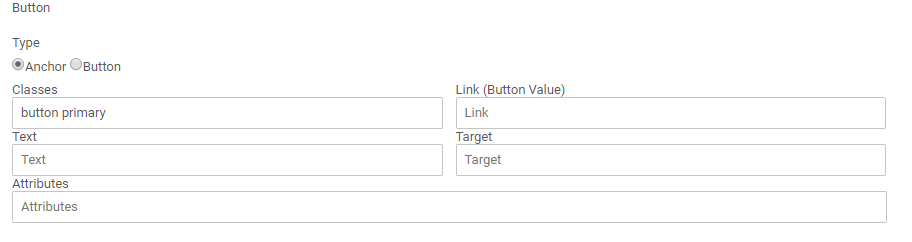
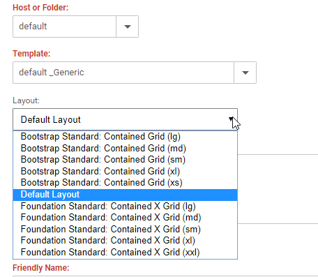
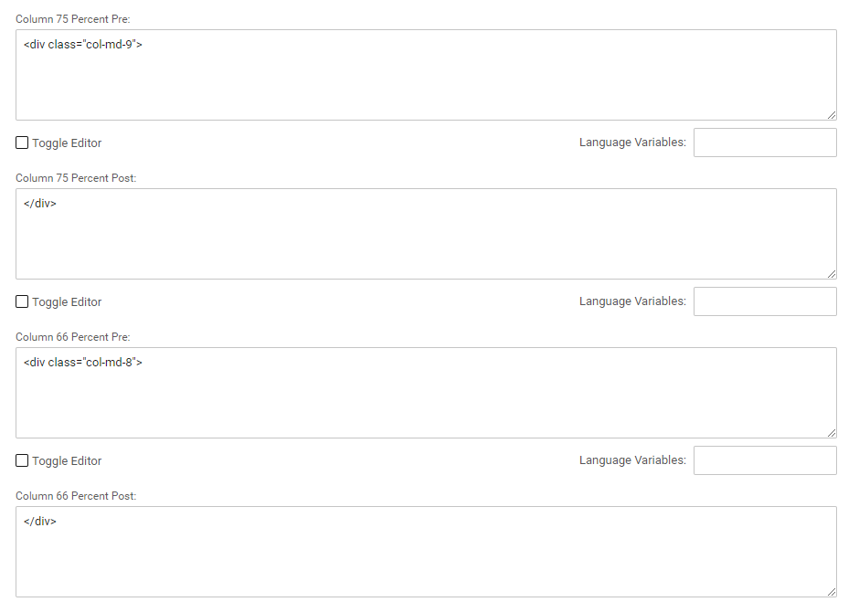
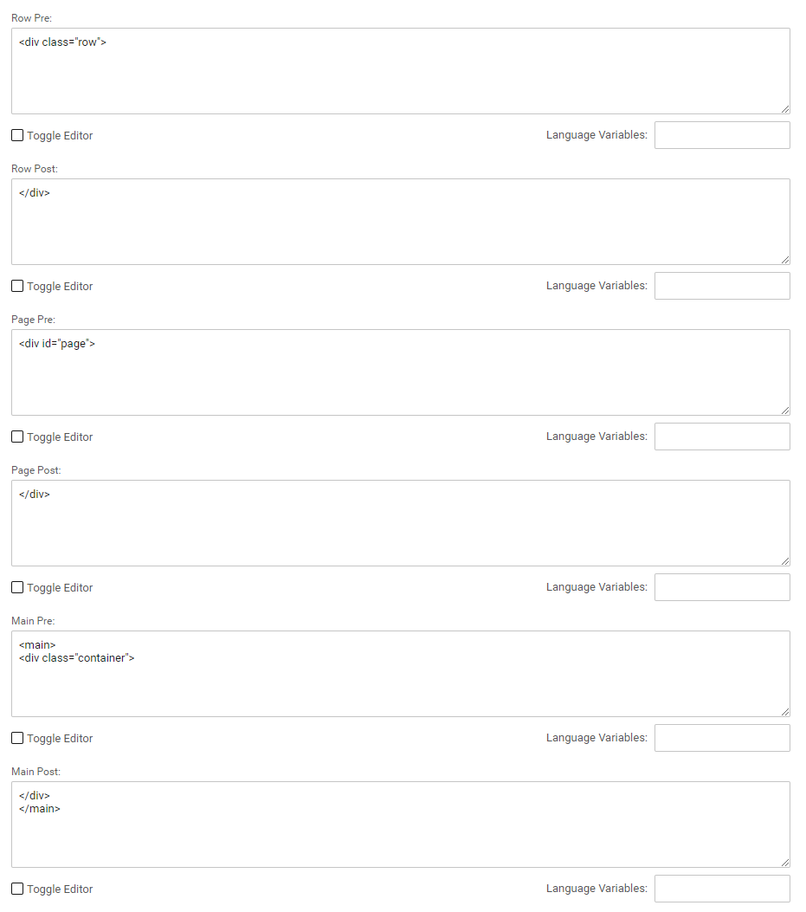
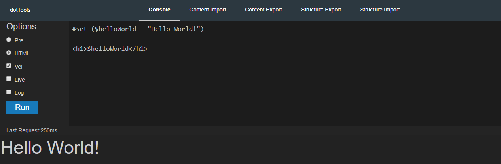
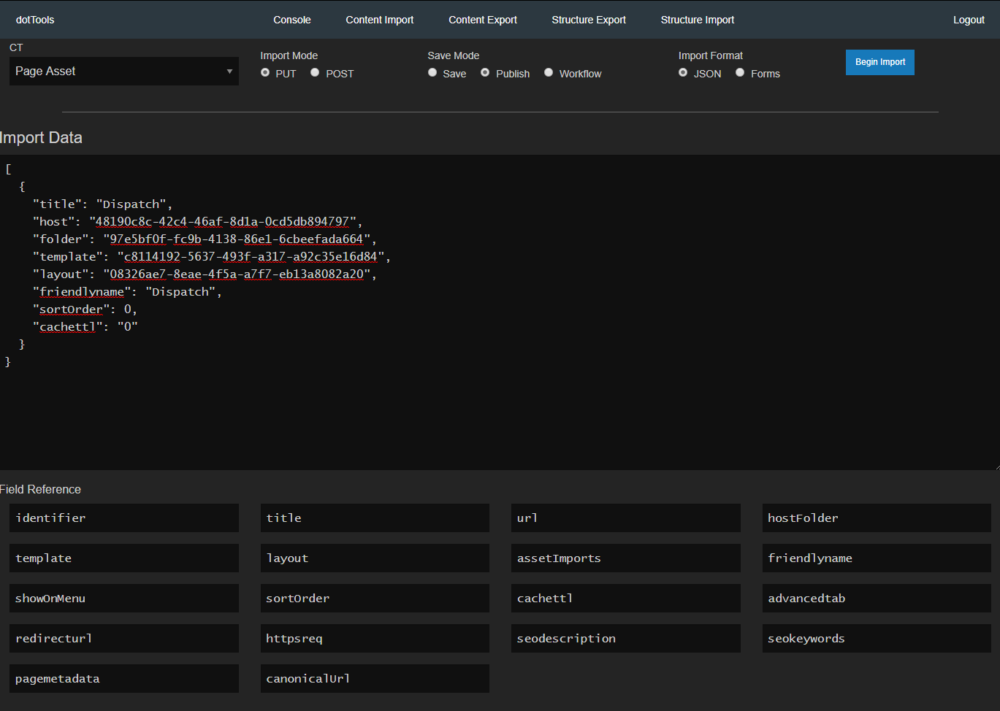
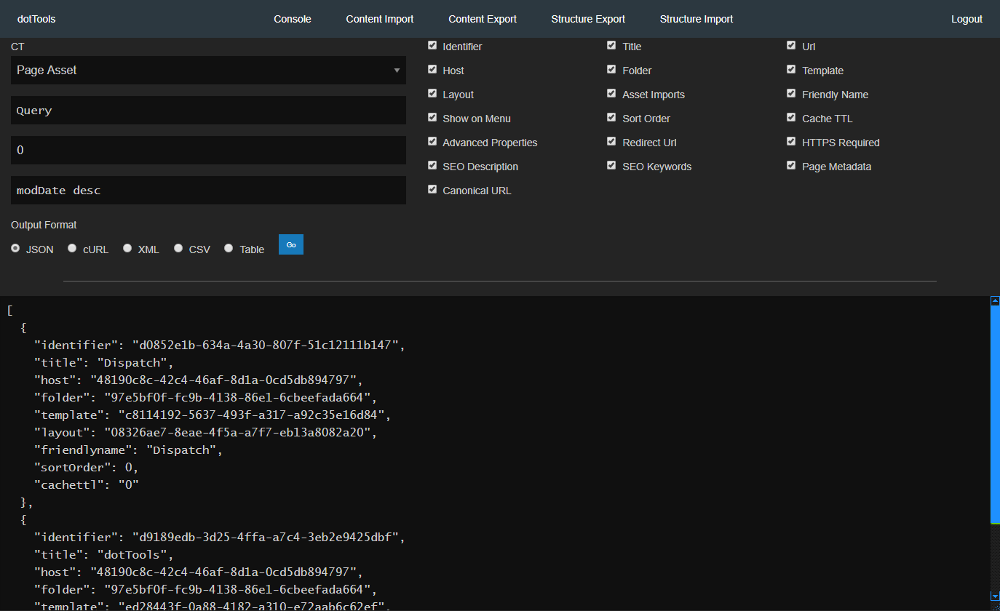

# dotCMS Starters

# Getting Started

## Prerequisites

* Have dotCMS extracted and appropriate config and root folder Plugins directories ready to go

&nbsp;&nbsp;&nbsp;&nbsp;&nbsp;
See [dotCMS installation guide](https://github.com/x0rsw1tch/DotCMSVelocity/blob/master/dotcms-installation.md#dotcms-installation-1) for information on how to set this up.


## Installation

1. Place desired starter file with in static plugin Root
    + `plugins/com.dotcms.config/ROOT/dotserver/tomcat-8.5.32/webapps/ROOT`
1. Use a root folder plugin to override the default starter
    +  STARTER_DATA_LOAD=/starter-plus-tools_0.4.zip

---
# What's Included

## Minimal

Only the base content types and back-end references for dotrCMS to function.


## With Tools

&nbsp;&nbsp;&nbsp;&nbsp;&nbsp;
Contents of the minimal starter along with some addtional utilities:

* dotTools Velocity console and importer/exporter
* Pre-set directory tree and assets (jQuery, Bootstrap, Foundation6, Vue)
* Improved Template Layout System
* Extended Mata-Data inputs for Page Assets and URLMapped CTs

---
# How to Use

To utilize the capabilities of the included tools, check out the indiviudal sections below.


## Directory Structure


The directory structure is a middle ground of the dotCMS way of implementing a site structure and modern standards. It's not perfect, but it certainly works :)

```
/
├───application
│   ├───async                          Velocity for returning HTML or JSON not
│   │                                  intended as functional widgets
│   │
│   ├───containers                     Velocity files for handling container
│   │                                  velocity code, as opposed
│   │                                  to putting your content code
│   │                                  directly into the container. This
│   │                                  allows for using the same code 
│   │                                  without copy/pasting into multiple
│   │                                  containers, makes updating or 
│   │                                  creating new Containers much
│   │                                  easier, and allows for calling the
│   │                                  files indirectly
│   │
│   │       content-generic.vtl        #dotParse() in Containers that use
│   │                                  Content (Generic)
│   │
│   │       file-asset.vtl             #dotParse() in containers that use
│   │                                  File Asset
│   │
│   │       velocity-include.vtl       #dotParse() in containers that use
│   │                                  Velocity Include
│   │
│   ├───custom-fields
│   │
│   │       field-button.vtl           Custom field for generating links
│   │                                  with custom attributes instead
│   │                                  of having multiple fields for
│   │                                  buttons
│   │
│   │       markdown-editor.vtl        Custom field for generating Markdown
│   │                                  content, with live preview
│   │
│   │      template-layout.vtl         Custom field for generating the
│   │                                  layout drop-down in Page Assets
│   │
│   │
│   ├───includes                       A generic includes folder
│   │
│   │       asset-imports.vtl          Pulled in with theme files to 
│   │                                  generate markup for CSS/JS files
│   │                                  in the appropriate places
│   │
│   │       globals.vtl                Global utility vars and "constants"
│   │
│   │       options.vtl                Additional vars and misc
│   │
│   │       social-meta.vtl            Generates meta-data for Search Engines
│   │                                  and Social Media platforms
│   │
│   │       template-parameters.vtl    Generates Template Layout Wrapper
│   │                                  markup objects
│   │
│   ├───macros                         Housing macro files without cluttering
│   │                                  up various VTL folders
│   │
│   │       button.vm                  For use with "button" custom fields
│   │                                  #GenerateButton(JSON_String data)
│   │
│   │       json-get.vm                Gets JSON, replacing null string with
│   │                                  false
│   │                                  #GetData(String URL, String Params)
│   │
│   │       truncate-string.vm         Utility for truncating strings in a
│   │                                  friendly way
│   │                                  #friendlyTruncateString(String string,
│   │                                  [Int wordLimit=25, Int charLimit=170])
│   │
│   │       slugify.vm                 kebab cases strings
│   │                                  #slugify(String string)
│   │
│   │       template-column.vm         Macro for Template Layouts
│   │
│   ├───themes                         Standard dotCMS themes folder
│   │   └───ethode
│   │
│   │           header.vtl             body > header
│   │           footer.vtl             body > footer
│   │           html-head.vtl          html > head
│   │           template.vtl           Theme base file, pulls in all other
│   │                                  theme files
│   │           bottom.vtl             Bottom of /body
│   │
│   └───util                           Velocity files/assets for internal
│       │                              "utility" use
│       │
│       │   assets                     Directory containing internal assets
│       │                              for use with utilities. Can be used
│       │                              for temporary site use.
│       │
│       │   console.vtl                Velocity console front-end
│       │
│       │   container-info.vtl         Displays information about container
│       │                              in edit mode
│       │
│       │   contentlet-info.vtl        Displays information individual
│       │                              contentlets in edit mode
│       │
│       │   dispatch                   Page Asset that receives velocity text
│       │                              and eval's it
│       │
│       │   drop-console.vtl           (WIP) Front-end code for Velocity
│       │                              console that can be pulled into any
│       │                              page
│       │
│       │   md-preview                 Endpoint for Markdown Preview output
│       │
│       │   tools                      Page asset for dotTools
│       │
│       │
│       └───assets                     Directory containing internal assets
│           │                          for use with utilities. Can be used
│           │                          for temporary site use.
│           ├───css
│           ├───fonts
│           ├───img
│           └───js
├───css                                Front-end CSS/SCSS/LESS
├───docs                               Front-end Document Files
├───fonts                              Front-end Fonts
├───img                                Front-end Images
├───js                                 Front-end JavaScript
├───json                               Front-end JSON Files
└───static                             Front-end Static Pages

```

---
# Content Types / Fields

## Asset Imports

Each page asset has an Asset Imports (textarea) field for pulling in assets manually that are not included in the theme file. There are several options for using this field.

Place each asset to be imported on its own line. Start the line with one of the following options, HTML output is also generated in this order:

```
css,         CSS in <head>
js_head,     JS in <head>
vtljs_head   Velocity Generated JS in <head>
js,          JS above /body
vtljs,       Velocity Generated JS above /body
```

After the comma, place the URL to your asset to be imported.

Example: `css,css/styles.css`

Example: `css,DOTSASS/css/styles.css`

Example: `js,https://cdn.jsdelivr.net/npm/vue@2.5.17/dist/vue.js`

---
## Button Generator

1. Create a custom field with a `#dotParse('/application/custom-fields/field-button.vtl')`
1. You will get a field that looks like this:

1. Wherever this button is to be output, use the `#GenerateButton()` macro

<sub>Note: This custom field generates a JSON object, the capabilities of this field can be extended for whatever use.</sub>

---
## Template Parameters

Allows for using custom row and column wrappers in dotCMS Basic Templates, instead of hard-coding markup wrappers in theme files. Layouts have a default Layout as a fallback. The layout field is a custom field as a drop-down selector located in the Page Asset Content Type.

When used in Page Asset, you'll see a select field just below "Template" to select a Layout



Layouts are defined in the `Template Parameters` Content Type. For each layout, you'll have pre and post wrapper options for each component. All fields are optional.

```
Row:           Wraps around each row defined in Template Designer
Page:          Inner-wrapper for <body>
Main:          Wraps around all rows and columns
Header:        <header> and whatever else you want [inner]-wrapped
Footer:        <footer> and whatever else you want [inner]-wrapped

Column 100%:   Wrapper for each 100% column
Column 75%:    Wrapper for each 75% column
Column 66%:    Wrapper for each 66% column
Column 50%:    Wrapper for each 50% column
Column 33%:    Wrapper for each 33% column
Column 25%:    Wrapper for each 25% column
```

Here are examples of a Bootstrap Layout

Columns



Row


---
## Structured Content Extended Meta-Data

dotCMS's base facilities for SEO is a little bit too limited. The Content Type, Structured Content Extended Meta-Data, allows for expanding on the base SEO items with additional data types from schema.org and Social Media Platforms. This also includes extending URL Mapped Content Types.

Here's a brekdown of the content Type Fields:

### Content Tab

| Field                  | Function
| ---------------------- |--------------
| Content Type           | "default", arbitrary name or Content Type
| Type                   | [og:type](http://ogp.me/#types)
| Locale                 | [og:locale](http://ogp.me/#optional)
| Alternate Locale       | [og:locale:alternate](http://ogp.me/#optional)
| Additional Parameters  | [Addtional Structured OpenGraph Properties](http://ogp.me/#structured)


### Image Data

| Field         | Function
| ------------- |--------------
| Image File    | Scraper / Social Media Image


### Social Media

| Field           | Function
| --------------- |--------------
| Facebook App Id | Facebook App Id
| Twitter Card    | Share Post Style Type
| Twitter Site    | Twitter Handle
| Twitter Creator | Twitter Author


### URL Mapped

| Field                            | Function
| -------------------------------- |--------------
| Title Field                      | Field in CT to get Page Title/og:title
| Description Field                | Field in CT to get Meta Desciption/og:description
| Image Field Type                 | Binary or Image Field in CT
| Image Field                      | Image Field to get Page Meta Image
| Use Global Extended Parameters   | Whether to use CT or SCEMD contentlet for parameters
| Additional Parameters Field Type | Type of Field that contains additional parameters
| Additional Parameters Field Name | Field in CT that contains the addional parameters

---
# Built-in Templates

Built-in utility templates are all prefixed with an underscore `_`


## _dotTools

Contains an Advanced Template that is used by `dotTools`


## _Markdown Previewer

`md-preview`'s Template


## _Generic

Generic use Template for internal use


## _Velocity Console Back-End

Velocity Parser Code

---
# dotTools Utilities

dotTools is a back-end UI for performing various utility functions in dotCMS.

This can be accessed by browsing to: /application/util/tools

<sub>Pro Tip: Add `?nologin` to skip authentication. Items requiring authentication will not function.</sub>

## Console



Allows you to run Velocity code and get results on the fly. This is very useful for testing, generating scripts, or prototyping.

### Console Options

| Option  | Function
| ------- |--------------
| Pre     | Use Pre-formatted output
| HTML    | Use HTML output
| Vel     | Evaluate Velocity Code
| Live    | Live Update
| Log     | Log each submitted entry

<sub>Pro Tip: Use Ctrl+Enter to "Run"</sub>

### History

Shows a history of each code submitted 

#### Useful things

Snippets and misc things Velocity


## Content Import

Provide an Array of objects to import contentlets, or fill out input fields for quick importing. 




## Content Export

Allows for exporting dotCMS contentlets in various formats. The fields to be exported can be deselected.

Export Formats:
```
JSON
cURL commands
XML
CSV
HTML Table
```




## Structure (CT) Export

Export Content Types (WIP)


## Structure (CT) Import

Import Content Types (WIP)